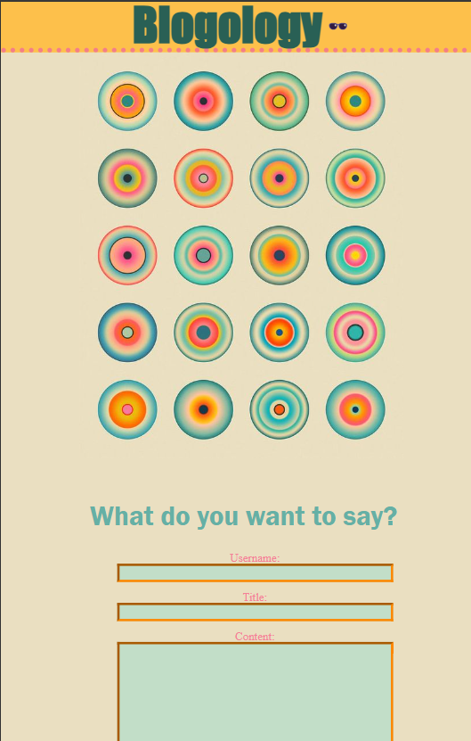
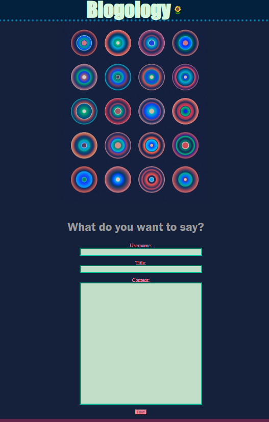

# **Blogology**

## 📰 Description

A place to locally keep your thoughts

## 🔎 Table of Contents

- [Installation](#installation)
- [Usage](#usage)
- [Questions](#questions)
- [License](#license)

## 💾 Installation 

Visit the site [here](https://thistish.github.io/Blogology/)

## 🖱️ Usage 

Visit [Blogology](https://thistish.github.io/Blogology/) and fill out the form with your username, title, and post content. Upon submission, you'll be taken to a page displaying your new post along with any previous posts. If the display is too bright, you can switch between light and dark mode by clicking the sunglasses/sunflower icon. To add another post, simply click the back button to return to the homepage with the form. Don't forget to check out my portfolio at the bottom of the page!

## ✋ Questions 

If you have any questions, feel free to contact me at:

- *GitHub: [[ThisTish](https://github.com/ThisTish)](https://github.com/[ThisTish](https://github.com/ThisTish))*
- *Contact: tish.sirface@gmail.com*

## 🪪 License 

MIT License

        Copyright 2024 Tish Sirface

        Permission is hereby granted, free of charge, to any person obtaining a copy of this software and associated documentation files (the “Software”), to deal in the Software without restriction, including without limitation the rights to use, copy, modify, merge, publish, distribute, sublicense, and/or sell copies of the Software, and to permit persons to whom the Software is furnished to do so, subject to the following conditions:
        
        The above copyright notice and this permission notice shall be included in all copies or substantial portions of the Software.
        
        THE SOFTWARE IS PROVIDED “AS IS”, WITHOUT WARRANTY OF ANY KIND, EXPRESS OR IMPLIED, INCLUDING BUT NOT LIMITED TO THE WARRANTIES OF MERCHANTABILITY, FITNESS FOR A PARTICULAR PURPOSE AND NONINFRINGEMENT. IN NO EVENT SHALL THE AUTHORS OR COPYRIGHT HOLDERS BE LIABLE FOR ANY CLAIM, DAMAGES OR OTHER LIABILITY, WHETHER IN AN ACTION OF CONTRACT, TORT OR OTHERWISE, ARISING FROM, OUT OF OR IN CONNECTION WITH THE SOFTWARE OR THE USE OR OTHER DEALINGS IN THE SOFTWARE.

